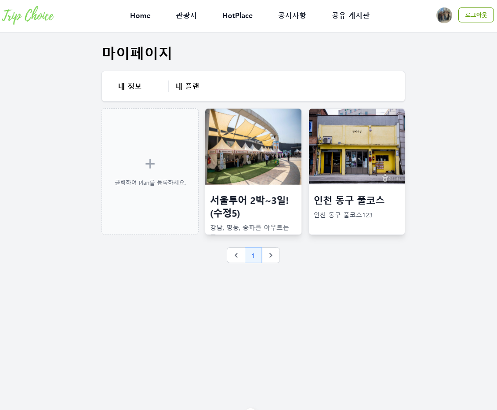

# TripChoice

### 📌 프로젝트 설명  
- 관광지를 탐색하고 여행을 위한 플랜을 설정할 수 있는 사이트 개발

## 🚀 기능  
-  [O] 국내 관광지 리스트 조회
-  [O] 여행 플랜 등록, 조회, 수정, 삭제
-  [O] 인기 관광지 등록, 조회
-  [O] 공지사항 등록, 조회, 수정, 삭제
-  [O] 날씨 정보 조회
-  [-] 현재 주소 기반 관광지 키워드 추천(GPT 활용)

## 📷 스크린샷  
### 1. 메인 페이지 

  
  

 

### 2. 관광지 지도 페이지  
 

__주소, 카테고리를 통한 검색__  

__1박 2일 플랜 설정__  

 
  
### 3. 인기 관광지 페이지
 

  

  
  

 

### 4. 공지사항 페이지
 

  
  

 

### 5. 회원 페이지
 

  
  

  
  

 

### 6. 플랜 페이지
 

  
  

 

## ⏳ 개발 기간

__기본 기능__  
24.11.14 ~ 24.12.24 (6주)  
 

__추가 기능__  
GPT 태그 기능:  24.12.25 ~ 24.12.28  
날씨 조회 기능: 25.03.17 ~ 25.03.19 
   

## 💻 기술 스텍

 
   
  
  
   
   
   
   

 

## 💻 새로 배운 기술

__Back-End__
- SpringBoot, JPA를 활용한 CRUD 기능 구현
- Spring Sequrity, jwt를 활용한 로그인, 인가(Admin, User) 기능 구현
- QueryDSL을 활용해 관광지 검색 조건 구현(주소, 거리, 카테고리 등 여러 조건을 동적으로 추가)
- 공공 데이터 API를 활용한 날씨 데이터(XML) 수집 및 전처리(DocumentBuilder) 출처: https://www.data.go.kr/tcs/dss/selectApiDataDetailView.do?publicDataPk=15084084
- GPT를 활용한 태그 추천 기능 구현
 

__Front-End__
- Vue 컴포넌트 설계 및 구현
- Tailwind를 활용한 UI 디자인
- axios를 활용한 server 통신
- Vue와 연관된 기술(router, pinia) 습득 및 활용
- KakaoMap API를 활용한 플랜 경로 시각화
 

## 🛠 설치 및 실행 방법  

### 공통

__1. 저장소 클론__  
git clone https://github.com/straipe/TripChoice.git

__2. 디렉토리 이동__  
cd TripChoice

### Front-end

__3. 필요한 패키지 설치__  
npm install

__4. 실행__  
npm start dev

### Back-end

__5. MySQL dump 실행__  

__6. Intellij로 실행__  
